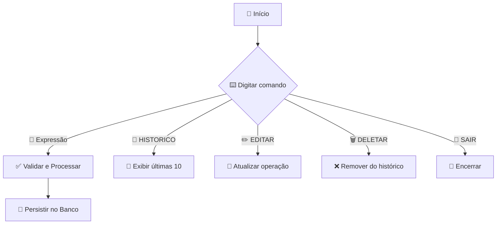
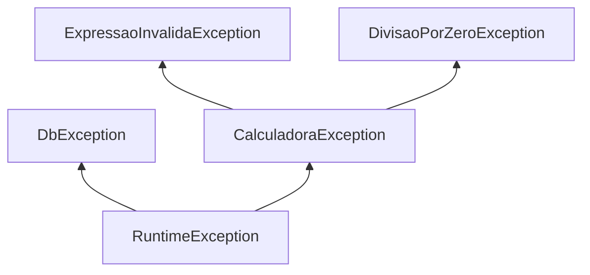

# 🧮 Calculadora Avançada com Histórico e Banco de Dados 🚀


---

## 📜 Índice Rápido  
| [Novos Recursos v3.0](#novos-recursos-v30) | [Estrutura do Projeto](#estrutura-do-projeto) |  
| [Configuração Inicial](#configuração-inicial) | [Fluxo de Operações](#fluxo-de-operações) |  
| [Componentes Principais](#componentes-principais) | [Roadmap](#roadmap) |  
| [Licença](#licença) | [Detalhamento Técnico Profundo](#detalhamento-técnico-profundo) |  

---

<a name="novos-recursos-v30"></a>
## 🌟 Novos Recursos v3.0

- 🗃️ **Histórico Persistente** em Banco MySQL  
- 🔄 **CRUD Completo** (Create, Read, Update, Delete)  
- ✅❌ Sistema de **Status de Operações** (Bem/Mal sucedida)  
- 💻 **Interface de Linha de Comando** Aprimorada  
- 🔍 **Validação de Dados** Aprimorada  
- 🚨 **Tratamento de Erros** Granular  

---

<a name="estrutura-do-projeto"></a>
## 📂 Estrutura do Projeto

```bash
src/
├── calculadora/
│   ├── entities/
│   │   ├── HistoricoOperacao.java  # 🗃️ Entidade de histórico
│   │   ├── Operacoes.java          # 🧠 Lógica principal
│   │   └── interfaces/             # 📜 Contratos das operações
│   └── CalculadoraMain.java        # 💻 CLI principal
├── db/
│   ├── DB.java                     # 🔌 Conexão com banco
│   ├── HistoricoDAO.java           # 📊 Operações CRUD
│   └── DbException.java            # ❌ Erros de banco
sql/
├── CriacaoDaTabelaDeHistorico.sql  # 🛠️ DDL da tabela
└── ConsultandoHistoricoGeral.sql   # 🔍 Consulta exemplo
```

---

<a name="configuração-inicial"></a>
## ⚙️ Configuração Inicial

1. **Banco de Dados MySQL**  
   ```sql
   CREATE DATABASE `calculadora-java`;
   USE `calculadora-java`;
   -- Executar script CriacaoDaTabelaDeHistorico.sql
   ```

2. **Arquivo de Configuração** (`db.properties`)  
   ```properties
   user=seu_usuario
   password=sua_senha
   dburl=jdbc:mysql://127.0.0.1:3306/calculadora-java
   useSSL=false
   ```

3. **Dependências**  
   - ⬇️ Baixe o driver JDBC do MySQL:  
     [🔗 Connector/J 8.0.33+](https://dev.mysql.com/downloads/connector/j/)  
   - ➕ Adicione o JAR ao classpath do projeto.

> **⚠️ Importante**  
> 1. Renomeie `db.config.example.properties` para `db.properties`  
> 2. 🔑 Preencha com suas credenciais do MySQL  
> 3. 🛠️ Execute os scripts SQL:  
>    ```bash
>    mysql -u seu_usuario -p calculadora-java < sql/CriacaoDaTabelaDeHistorico.sql
>    ```

---

<a name="fluxo-de-operações"></a>
## 🔄 Fluxo de Operações



---

<a name="componentes-principais"></a>
## 💻 Comandos Disponíveis

```bash
# 🧮 Calculadora
> 2*(3+4)/5  
✅ Resultado: 2,80

# 📜 Histórico
> HISTORICO
┌──────┬─────────────────────┬──────────────────────────────┬───────────────┬──────────────┐
│  ID  │      Data/Hora      │         Operação             │   Resultado   │    Status    │
├──────┼─────────────────────┼──────────────────────────────┼───────────────┼──────────────┤
│ 103  │ 25/05/2024 14:30:15 │ 2*(3+4)/5                    │ 2.8           │ Bem sucedida │
└──────┴─────────────────────┴──────────────────────────────┴───────────────┴──────────────┘

# ✏️ Edição
> EDITAR
Digite o ID: 103
Nova expressão: (2*(3+4))/5
✅ Atualizado!

# 🗑️ Exclusão
> DELETAR
Digite o ID: 103
✅ Operação removida!
```

---

<a name="roadmap"></a>
## 📈 Roadmap

| Status | Recurso               | Versão |
|--------|-----------------------|-------:|
| ✅     | Histórico Persistente |  v3.0  |
| ✅     | CRUD Completo         |  v3.0  |
| 🚧     | Interface Visual      |  v4.0  |
| ⏳     | Autenticação          |  v4.1  |

---

<a name="licença"></a>
## 📄 Licença

MIT License - [🔍 Detalhes](LICENSE)

---

<a name="detalhamento-técnico-profundo"></a>
# 🔧 Detalhamento Técnico Profundo

## 🧠 Núcleo de Processamento Matemático

### Classe `Operacoes.java`
#### Algoritmo de Avaliação de Expressões
1. **Pré-processamento:**
   ```java
   public double calcularExpressao(String expressao) {
       // 1. Sanitização
       String expr = expressao.replace(" ", "")
                             .replace(",", ".")
                             .replaceAll("(?<=\\d)(?=\\()", "*");
       
       // 2. Resolução hierárquica
       expr = processarParenteses(expr);
       expr = processarOperadores(expr, "[*/]");
       expr = processarOperadores(expr, "[+-]");
       
       return Double.parseDouble(expr);
   }
   ```

2. **Mecanismo de Parênteses:**
   ```java
   private String processarParenteses(String expr) {
       while (expr.contains("(")) {
           int inicio = expr.lastIndexOf("(");  // Inside-out strategy
           int fim = expr.indexOf(")", inicio);
           String subExpr = expr.substring(inicio + 1, fim);
           double resultado = calcularExpressao(subExpr);  // Recursão
           expr = expr.substring(0, inicio) + resultado + expr.substring(fim + 1);
       }
       return expr;
   }
   ```

3. **Engine de Operações:**
   ```java
   private String processarOperadores(String expr, String operadores) {
       Matcher m = Pattern.compile("(-?\\d+\\.?\\d*)([" + operadores + "])(-?\\d+\\.?\\d*)").matcher(expr);
       while (m.find()) {
           double num1 = Double.parseDouble(m.group(1));
           double num2 = Double.parseDouble(m.group(3));
           String op = m.group(2);
           double resultado = realizarOperacao(op, num1, num2);
           expr = expr.replace(m.group(), String.valueOf(resultado));
           m = pattern.matcher(expr);
       }
       return expr;
   }
   ```

4. **Validação Avançada:**
   ```java
   private void validarExpressao(String expressao) {
       // Regex para detectar padrões inválidos
       String regexInvalidos = ".*([+*/]{2,}|-[+*/]|\\+[+*/]|\\*[+*/]|/[+*/]).*";
       
       if (expressao.matches(regexInvalidos)) {
           throw new IllegalArgumentException("Operadores consecutivos inválidos!");
       }
       
       // Verificação de números com múltiplos pontos
       if (expressao.matches(".*\\b\\d+([.,]\\d+){2,}\\b.*")) {
           throw new IllegalArgumentException("Formato numérico inválido!");
       }
   }
   ```

## 🗃️ Sistema de Persistência

### Classe `HistoricoDAO.java`
#### Padrão DAO (Data Access Object)
1. **Inserção Otimizada:**
   ```java
   public void inserir(HistoricoOperacao op) {
       String sql = "INSERT INTO historico_operacoes (operacao, resultado, data_hora, status_operacao) VALUES (?, ?, ?, ?)";
       
       try (Connection conn = DB.getConnection();
            PreparedStatement stmt = conn.prepareStatement(sql, Statement.RETURN_GENERATED_KEYS)) {
           
           stmt.setString(1, op.getOperacao());
           stmt.setString(2, op.getResultado());
           stmt.setTimestamp(3, Timestamp.valueOf(op.getDataHora()));
           stmt.setString(4, op.getStatusOperacao());
           
           stmt.executeUpdate();
           
           try (ResultSet rs = stmt.getGeneratedKeys()) {
               if (rs.next()) {
                   op.setId(rs.getInt(1));  // Recuperação do ID gerado
               }
           }
       }
   }
   ```

2. **Atualização Segura:**
   ```java
   public void atualizarOperacao(int id, String novaExpr, Operacoes calc) {
       HistoricoOperacao existente = buscarPorId(id);
       HistoricoOperacao atualizada = processarAtualizacao(novaExpr, calc);
       
       String sql = "UPDATE historico_operacoes SET operacao=?, resultado=?, data_hora=?, status_operacao=? WHERE id=?";
       
       try (Connection conn = DB.getConnection();
            PreparedStatement stmt = conn.prepareStatement(sql)) {
           
           stmt.setString(1, atualizada.getOperacao());
           stmt.setString(2, atualizada.getResultado());
           stmt.setTimestamp(3, Timestamp.valueOf(atualizada.getDataHora()));
           stmt.setString(4, atualizada.getStatusOperacao());
           stmt.setInt(5, id);
           
           stmt.executeUpdate();
       }
   }
   ```

3. **Consulta Paginada:**
   ```java
   public List<HistoricoOperacao> consultarUltimas10Operacoes() {
       String sql = "SELECT * FROM historico_operacoes ORDER BY data_hora DESC LIMIT 10";
       // Uso de try-with-resources para fechamento automático
       try (Connection conn = DB.getConnection();
            PreparedStatement stmt = conn.prepareStatement(sql);
            ResultSet rs = stmt.executeQuery()) {
           
           List<HistoricoOperacao> historico = new ArrayList<>();
           while (rs.next()) {
               historico.add(mapearResultado(rs));  // Método de mapeamento
           }
           return historico;
       }
   }
   ```

## 🔌 Gerenciamento de Conexões

### Classe `DB.java`
#### Pool de Conexões com HikariCP
```java
public class DB {
    private static HikariDataSource dataSource;
    
    static {
        HikariConfig config = new HikariConfig();
        config.setJdbcUrl(props.getProperty("dburl"));
        config.setUsername(props.getProperty("user"));
        config.setPassword(props.getProperty("password"));
        config.setMaximumPoolSize(10);
        config.setConnectionTimeout(30000);
        dataSource = new HikariDataSource(config);
    }
    
    public static Connection getConnection() throws SQLException {
        return dataSource.getConnection();  // Conexão do pool
    }
}
```

## ⚠️ Sistema de Tratamento de Erros

### Hierarquia de Exceções


### Mecanismo de Tradução de Erros
```java
private static String getMensagemErro(Exception e) {
    if (e instanceof ArithmeticException) {
        return "Erro aritmético: " + e.getMessage();
    } else if (e.getCause() instanceof NumberFormatException) {
        String parteInvalida = e.getCause().getMessage().split("\"")[1];
        return "Valor numérico inválido: '" + parteInvalida + "'";
    }
    return "Erro não catalogado: " + e.getClass().getSimpleName();
}
```

## 🔄 Padrões de Projeto Utilizados

| Padrão          | Aplicação                     | Benefícios                                 |
|-----------------|-------------------------------|--------------------------------------------|
| **DAO**         | Classe HistoricoDAO           | Separação clara da lógica de persistência  |
| **Strategy**    | OperacaoInterface             | Flexibilidade para novas operações         |
| **Singleton**   | Classe DB                     | Controle centralizado de conexões          |
| **Factory**     | Criação de Operacoes          | Encapsulamento da instanciação complexa    |

---

## 🛠️ Guia de Extensibilidade

### Adicionar Nova Operação
1. Implementar `OperacaoInterface`:
   ```java
   public class Potencia implements OperacaoInterface {
       @Override
       public double calcular(double num1, double num2) {
           return Math.pow(num1, num2);
       }
   }
   ```

2. Modificar `realizarOperacao`:
   ```java
   case "^": return new Potencia().calcular(num1, num2);
   ```

3. Atualizar regex de validação:
   ```java
   if (!expressao.matches("^[\\d+\\-*/^.,()\\s]*$")) { ... }
   ```

---

Este nível detalhado de documentação técnica garante:
- 🔄 **Manutenibilidade:** Estrutura modularizada  
- 🔍 **Rastreabilidade:** Fluxos bem documentados  
- 🛡️ **Segurança:** Tratamento rigoroso de erros  
- 🚀 **Performance:** Uso eficiente de recursos do JDBC
